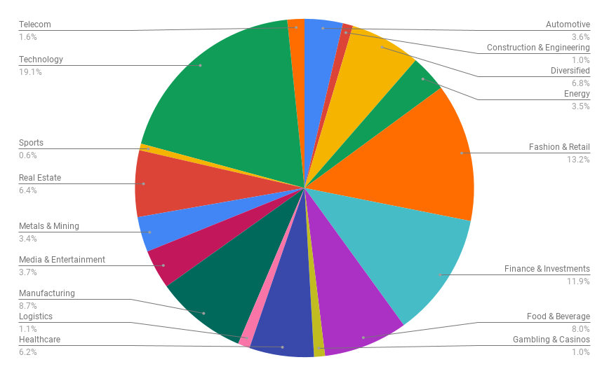

# Data Analysis #

## Data set details: ##

The dataset I decided to use was [Forbes Billionaires of 2021](https://www.kaggle.com/roysouravcu/forbes-billionaires-of-2021). It was found in Kaggle and its original format was CSV, and the analysis can be found [here](https://docs.google.com/spreadsheets/d/1129lhYFHR2WbpXfJqZavKTqyvK_NmktvNwhAdTo91ko/edit?usp=sharing).
|Name                                                                                     |NetWorth|Country      |Source         |Rank|Age|Industry  |FIELD8       |
|-----------------------------------------------------------------------------------------|--------|-------------|---------------|----|---|----------|-------------|
|Eric Wittouck                                                                            |$10 B   |Belgium      |investments    |228 |74 |Finance & Investments|             |
|Carl Cook                                                                                |$9.9 B  |United States|medical devices|230 |58 |Healthcare|             |
|Jan Koum                                                                                 |$9.9 B  |United States|WhatsApp       |230 |45 |Technology|             |
|Herbert Kohler                                                                           | Jr. & family|$9.8 B       |United States  |plumbing fixtures|232|82        |Manufacturing|
|Tobi Lutke                                                                               |$9.8 B  |Canada       |e-commerce     |232 |40 |Technology|             |
|James Dyson                                                                              |$9.7 B  |United Kingdom|vacuums        |234 |73 |Manufacturing|             |
|Mat Ishbia                                                                               |$9.7 B  |United States|‚òÖ            |234 |41 |Finance & Investments|             |
|Savitri Jindal & family                                                                  |$9.7 B  |India        |steel          |234 |71 |Metals & Mining|             |
|Friedhelm Loh                                                                            |$9.7 B  |Germany      |manufacturing  |234 |74 |Manufacturing|             |
|Iskander Makhmudov                                                                       |$9.7 B  |Russia       |mining, metals, machinery|234 |57 |Metals & Mining|             |
|Stefano Pessina                                                                          |$9.7 B  |Italy        |drugstores     |234 |79 |Fashion & Retail|             |
|Quek Leng Chan                                                                           |$9.7 B  |Malaysia     |banking, property|234 |79 |Diversified|             |
|Israel Englander                                                                         |$9.6 B  |United States|hedge funds    |241 |72 |Finance & Investments|             |
|Charles Ergen                                                                            |$9.6 B  |United States|satellite TV   |241 |68 |Media & Entertainment|             |
|Jim Pattison                                                                             |$9.6 B  |Canada       |diversified    |241 |92 |Diversified|             |
|Yao Liangsong                                                                            |$9.6 B  |China        |furniture      |241 |56 |Manufacturing|             |
|David Geffen                                                                             |$9.5 B  |United States|movies, record labels|245 |78 |Media & Entertainment|             |
|Yeung Kin-man                                                                            |$9.5 B  |Hong Kong    |electronics    |245 |57 |Manufacturing|             |
|Ding Shizhong & family                                                                   |$9.4 B  |China        |sports apparel |247 |50 |Fashion & Retail|             |
|Harold Hamm & family                                                                     |$9.4 B  |United States|oil & gas      |247 |75 |Energy    |             |
|Jim Kennedy                                                                              |$9.4 B  |United States|media, automotive|247 |73 |Media & Entertainment|             |           |


As it is possible to see in the original data set, there were a few edits that needed to be made in order for the data to be analyzed. I used Python and the CSV module to fix this errors, and then used Google Sheets to analyze the clean data. 
When looking at the raw data, I was able to find a few mistakes in the billionaires' names. Some of them had an extra comma in their names, which was being identified as a different column. I realized that it was happening due to specific words, so it was easier to delete them specifically as shown below:
```
line[1] = line[1].strip("Jr. & family")
        line[1] = line[1].strip("Jr.")
        line[1] = line[1].strip("II.")
        line[1] = line[1].strip("III.")
```
I wasn't, however, able to delete the entier column with this method. So what I decided to do, instead, was to move the columns to the left once the data was already in Google Sheets. I was able to select multiple columns at once, making it easier and optimal.
After that was fixed, I deleted the dollar signs from the NetWorth column so I could add the values and use them as a variable in my analyses. It was also necessary to fix some encoding problems that were in the original data set.

## Analysis ##
I used the following aggregated statistics:
### Aggregate statistics ###
* Max: I calculated the maximum net worth from the billionaires table. That means that the billionaire that has the highest net Wwrth is Jeff Bezos, with $177 billions.
* Min: I calculated the minimum net worth from the billionaires table. That means that the net worth of the billionaires that have the lowest net worth is $1 billion.
* Average: I calculated the average net worth of the billionaires, which is around $4.75 billions.
* Sum: I calculated the sum of all billionaires' net worth, which is around $13 trillions.

### Aggregate statistics with conditions ###
* Billionaires per Industry: I used the formula `<COUNTIF>` to count how many billionaires there are per industry.
* Billionaires per Industry with more than $5 billion: Since the average net worth is around $5 billion, I decided to find the amount of billionaires per industry that are above the average. I used the `<COUNTIFS>` formula for this.
* Maximum Net Worth per Industry: using the `<MAXIFS>` formula, I found the billionaire with the highest net worth in each industry.
* Sum of Net Worth per Industry: I used the `<SUMIF>` formula to calculate the total net worth of the billionaires per industry.
* Average Net Worth per Industry: With the `<AVERAGEIF>` formula, I was able to find the average net worth for each industry. 

## Chart ##

The pie chart shows the distribution of the net worth in the industries. It is possible to see that billionaires in technology have 19.1% of all billionaires' net worth. 

## Extra credit
I believe that I deserve extra credit because the database I used had more than 2700 entries. Besides, I was very interested in the topic, so I did more than the required four formulas for the analysis.